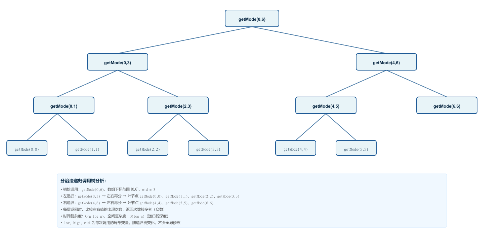
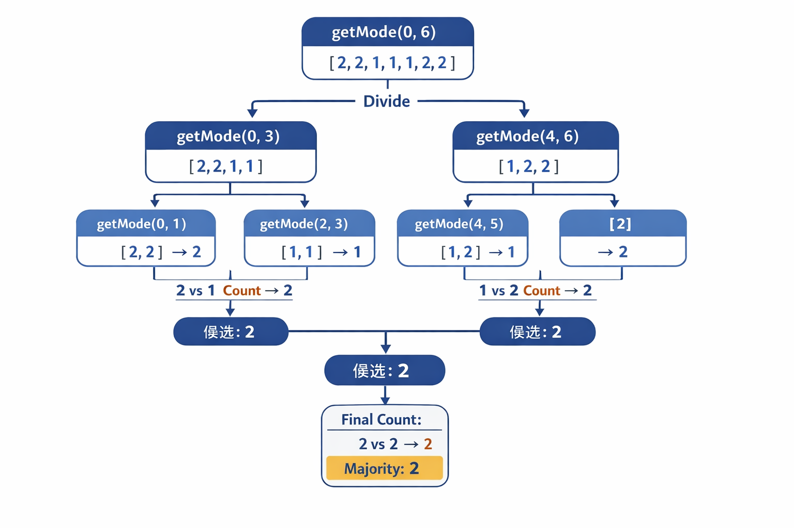

# 169多数元素

## 题目

给定一个大小为 `n` 的数组 `nums` ，返回其中的多数元素。多数元素是指在数组中出现次数 **大于** `⌊ n/2 ⌋` 的元素。

你可以假设数组是非空的，并且给定的数组总是存在多数元素。

**示例 1：**

```
输入：nums = [3,2,3]
输出：3
```

**示例 2：**

```
输入：nums = [2,2,1,1,1,2,2]
输出：2
```

**提示：**

- `n == nums.length`
- `1 <= n <= 5 * 104`
- `-109 <= nums[i] <= 109`
- 输入保证数组中一定有一个多数元素。

**进阶：**尝试设计时间复杂度为 O(n)、空间复杂度为 O(1) 的算法解决此问题。

## 解题思路

> 简单明了直接hash梭

```js
/**
 * @param {number[]} nums
 * @return {number}
 */
var majorityElement = function(nums) {
    const mostElement = nums.length / 2;
    const mapData = new Map();
    for (let i = 0; i < nums.length; i++) {
        if (!mapData.has(nums[i])) {
            mapData.set(nums[i], 1);
        }
        else {
            mapData.set(nums[i], mapData.get(nums[i]) + 1)
        }
        if (mapData.get(nums[i]) > mostElement) {
            return nums[i];
        }
    }
};
```


不是最优解，找到一篇很棒的题解，直接给了三种方式。贴出来膜拜一下

[多数元素题解（内含四种疗法）](https://leetcode.cn/problems/majority-element/solutions/1769626/-by-1105389168-viat)

## 思路

其实这个题很简单，找到数组中的大于`(n/2)`的数，那么就有了第一个变量，`const mostElement = nums.length / 2`，后续我们只需要记录每个元素出现的次数，用次数去对比`mostElement`，就可以得到我们想到的多数。

不过这个题有多种解法

1. 比较普通的`hash`，也是大部分人直接想到的。

2. 暴力的直接排序，取`n/2`下标的值就是最后要的多数。

3. 摩尔投票法。吃了没文化的苦 第一次听说（-_-||）

   - 取nums[0]为多数`majority`，记录`count`为1。代表第一个值出现了一次
   - 循环`nums`，如果`count === 0`，则让`majority = nums[i]` 
   - 如果`majority === nums[i]` ，则`count++`，反之`count--`。
   - 那么最后`return majority`，就是我们要的最后的多数

   > 思路还是蛮简单的。

4. 分治。没听过+1
   
   
