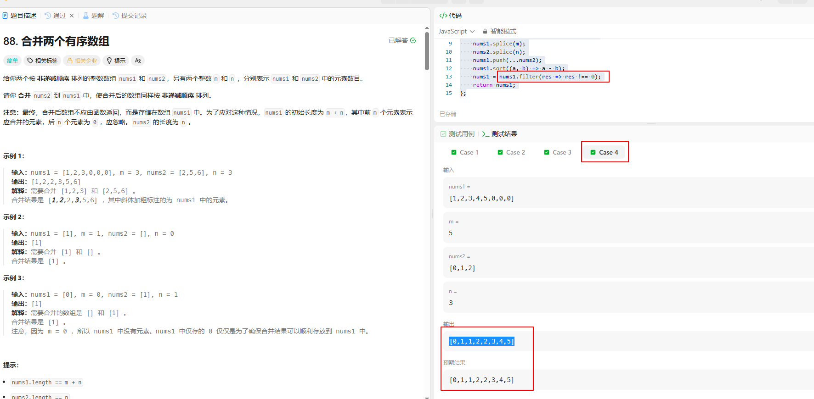

# 88合并两个有序数组

## 题目

给你两个按 **非递减顺序** 排列的整数数组 `nums1` 和 `nums2`，另有两个整数 `m` 和 `n` ，分别表示 `nums1` 和 `nums2` 中的元素数目。

请你 **合并** `nums2` 到 `nums1` 中，使合并后的数组同样按 **非递减顺序** 排列。

**注意：**最终，合并后数组不应由函数返回，而是存储在数组 `nums1` 中。为了应对这种情况，`nums1` 的初始长度为 `m + n`，其中前 `m` 个元素表示应合并的元素，后 `n` 个元素为 `0` ，应忽略。`nums2` 的长度为 `n` 。

**示例 1：**

```
输入：nums1 = [1,2,3,0,0,0], m = 3, nums2 = [2,5,6], n = 3
输出：[1,2,2,3,5,6]
解释：需要合并 [1,2,3] 和 [2,5,6] 。
合并结果是 [1,2,2,3,5,6] ，其中斜体加粗标注的为 nums1 中的元素。
```

**示例 2：**

```
输入：nums1 = [1], m = 1, nums2 = [], n = 0
输出：[1]
解释：需要合并 [1] 和 [] 。
合并结果是 [1] 。
```

**示例 3：**

```
输入：nums1 = [0], m = 0, nums2 = [1], n = 1
输出：[1]
解释：需要合并的数组是 [] 和 [1] 。
合并结果是 [1] 。
注意，因为 m = 0 ，所以 nums1 中没有元素。nums1 中仅存的 0 仅仅是为了确保合并结果可以顺利存放到 nums1 中。
```

**提示：**

- `nums1.length == m + n`
- `nums2.length == n`
- `0 <= m, n <= 200`
- `1 <= m + n <= 200`
- `-109 <= nums1[i], nums2[j] <= 109`
## 题解
```js
/**
 * @param {number[]} nums1
 * @param {number} m
 * @param {number[]} nums2
 * @param {number} n
 * @return {void} Do not return anything, modify nums1 in-place instead.
 */
var merge = function(nums1, m, nums2, n) {
    nums1.splice(m);
    nums2.splice(n);
    nums1.push(...nums2);
    nums1.sort((a, b) => a - b);
    nums1 = nums1.filter(res => res !== 0);
    return nums1;
};
```


> to low， 第二个简单题，又是没读懂题的一天。
### 实现思路
刚开始看完题觉得很简单，就是要取`nums1`的m长度和`nums2`的n长度合并，然后排除0，再来个正序就可以了。提交完看题解，才知道自己看题多粗心，没有细想直接开始干。最后的效果也很明显。只有8%的人被超越......

#### 误区1

没有看完题，注意事项里面写到了"`nums1` 的初始长度为 `m + n`，其中前 `m` 个元素表示应合并的元素，后 `n` 个元素为 `0` ，应忽略。`nums2` 的长度为 `n` "。

而我创造的例子是：

```js
nums1 = [1,2,3,4,5,6,0,0,0]; // 首先这里不符合了m+n的原则
nums2 = [0,1,2,3,0,5]; // 其次 n代表的就是数组长度，而不是要截取的，我们要做的其实是把nums2合并到nums1中
merge(nums1, 9, nums2, 3); // 这里的m参数已经不满足 m是nums1中的有效参数，应该是6，而nums1的初始长度应该是m+n, 9位。
/**
* 也就是说  我的nums1是[1,2,3,4,5,6,0,0,0]，则 num2 就是3位数，为[0, 1, 2]，调用函数则应该是merge(nums1, 6 nums2, 3);
*/

```

#### 误区2

本题并没有说到0要全部舍弃，严格意义来说我的代码应该是错误的。但不知道为什么平台竟然通过了我的代码。



> 已经提交了这个问题。不知道是不是我哪里有理解错了:sweat_smile:
>
>  https://github.com/LeetCode-Feedback/LeetCode-Feedback/issues/35008

## 最优解

```js
/**
 * @param {number[]} nums1
 * @param {number} m
 * @param {number[]} nums2
 * @param {number} n
 * @return {void} Do not return anything, modify nums1 in-place instead.
 */
const merge = (nums1, m, nums2, n) => {
    let index1 = m - 1; // 取nums1有效数组的最大下标 m - 1
    let index2 = n - 1; // 取nums2最大下标 n - 1
    let tail = m + n - 1; // 取nums1的最大下标
    // 从后往前排
    // index1和index2递减，直到有一个下标小于0
    while (index1 >= 0 && index2 >= 0) {
        // 如果nums1[index1]的值大于nums2[index2]的值 则让nums1[tail]的值等于nums1[index1] 之后让index1--
        if (nums1[index1] > nums2[index2]) {
            nums1[tail] = nums1[index1];
            index1--;
        }
        // 反之，则让nums1[tail]的值等于nums2[index2] 之后让index2--
        else {
            nums1[tail] = nums2[index2];
            index2--;
        }
        // 经过上面的逻辑， tail-- 来进行下一位的赋值
        tail--;
    }
    // 如果index1和index2其中有一个小于0，代表着有一个数组已经计算完成，只需要把另一个数组剩余的下标对应的值直接放到nums[tail]即可
    // 剩余的都一个一个插入到 nums1中
    while (index1 >= 0) {
        nums1[tail] = nums1[index1];
        index1--;
        tail--;
    }
    // 剩余的都一个一个插入到 nums1中
    while (index2 >= 0) {
        nums1[tail] = nums2[index2];
        index2--;
        tail--;
    }
    return nums1;
};
```


